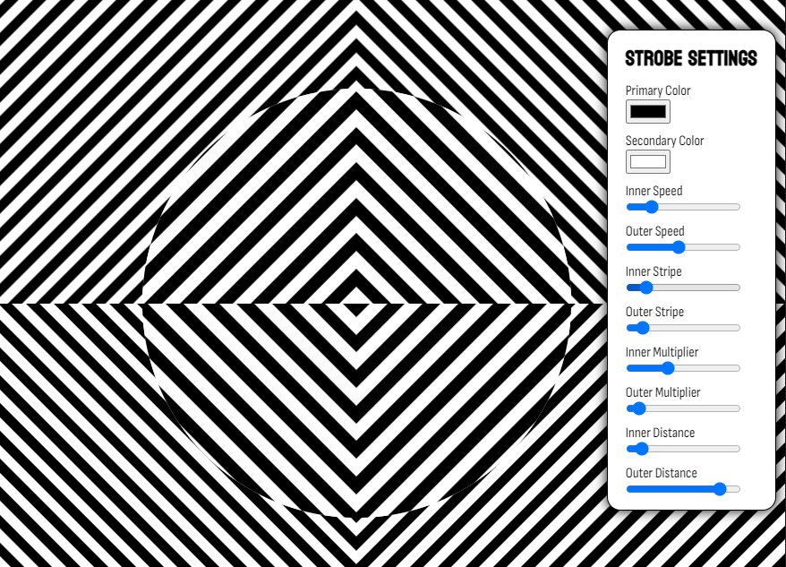

# strobe

One-day project taking a crack at recreating the [Neave Strobe](https://strobe.cool/) effect in mostly CSS. Some slight upgrades in my version include:

- a fully customizable menu (hover over the right side)
- an easy fullscreen toggle (hover over the bottom right corner)
- no countdown in the center

⚠ Note: this strobe effect may not be suitable for people with photosensitive epilepsy or sensitivity to flashing lights.

You can interact with a live demo [here](https://htmlpreview.github.io/?https://github.com/chris-p-schneider/strobe/blob/main/strobe.html).